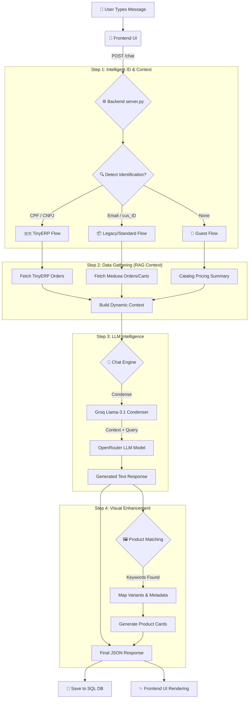

# 🤖 Yogateria Chatbot Workflow Architecture

This document provides a deep dive into the chatbot's processing lifecycle, from the moment a user types a message to the final visual response.

## 🌊 Complete Process Flow

---

## 🔍 Detailed Component Breakdown

### 1. User Interaction & Identification
*   **Auto-Detection**: The backend doesn't just wait for a login. It uses **Regex** to scan every message for identification patterns like `cus_...`, emails, or Brazilian CPF/CNPJ numbers.
*   **State Management**: For TinyERP users, the system maintains a `conversation_state`. It knows if it's waiting for a user to choose between "Recent Orders" or "Search by Date."

### 2. Context Gathering (The "Brain" of the Bot)
The chatbot uses **Retrieval-Augmented Generation (RAG)** to provide accurate answers:
*   **Catalog Sync**: Every time the server starts, it builds a [product_lookup](file:///Users/tirthpatel/Downloads/yoga2/chatbot/server.py#122-249) cache from [yogateria_products.json](file:///Users/tirthpatel/Downloads/yoga2/chatbot/yogateria_products.json).
*   **Pricing Truth**: A [generate_catalog_summary()](file:///Users/tirthpatel/Downloads/yoga2/chatbot/chatbot.py#11-106) function creates a "Category Pricing Overview" (e.g., "Cheapest Yoga Mat is BRL 89.00"). This is injected into the LLM's system prompt so it never hallucinates prices.
*   **Order API**: If an order number is detected (e.g., `#1234`), the backend performs a real-time fetch from the `ORDER_API_URL` to get the latest shipping status.

### 3. LLM Orchestration (How & Where LLM is Used)
We use a **Hybrid LLM Strategy** for speed and intelligence:
*   **Condensation (Groq)**: The `llama-3.1-8b-instant` model on Groq is used to instantly condense long chat histories into a single, focused search query.
*   **Reasoning (OpenRouter)**: The primary LLM (configured in `LLM_MODEL`) takes the condensed query, the retrieved order context, and the product summary to write the final response.
*   **Vector Store**: We use **Qdrant** to store and retrieve specific technical details about yoga products that aren't in the static JSON summary.

### 4. Product Card Intelligence
Unlike simple bots that only return text, this system "sees" what it has typed:
*   **Keyword Scan**: The server scans the LLM's response. If the LLM mentions "Yoga Mat," the server looks up the image, price, and URL.
*   **Variant Precision**: If the LLM mentions a color (e.g., "Blue"), the system specifically selects the variant card for the Blue version, including the specific `variant_id` and the correct thumbnail.
*   **Dynamic URLs**: URLs are automatically constructed with query parameters (e.g., `?Cor=Azul`) so the user lands on the exact product configuration they discussed.

### 5. Data Persistence & Performance
*   **PostgreSQL/SQLite**: Every interaction is logged with a `message_id`. This allows for the **Feedback System** (Thumbs Up/Down) which is stored in separate tables (`GOOD_FEEDBACK`, `BAD_FEEDBACK`) for future fine-tuning.
*   **Async Processing**: The system uses `FastAPI` and [lifespan](file:///Users/tirthpatel/Downloads/yoga2/chatbot/server.py#36-49) handlers to ensure the product cache and LLM connections are ready before the first request hits.

---

## 🛠️ Where is the Code?

| Functional Part | File Location | Key Function |
| :--- | :--- | :--- |
| **Routing & API** | [chatbot/server.py](file:///Users/tirthpatel/Downloads/yoga2/chatbot/server.py) | [chat_endpoint()](file:///Users/tirthpatel/Downloads/yoga2/chatbot/server.py#594-1160) |
| **LLM Setup** | [chatbot/chatbot.py](file:///Users/tirthpatel/Downloads/yoga2/chatbot/chatbot.py) | [setup_chatbot()](file:///Users/tirthpatel/Downloads/yoga2/chatbot/chatbot.py#107-207) |
| **ERP Integration** | [chatbot/tiny_erp.py](file:///Users/tirthpatel/Downloads/yoga2/chatbot/tiny_erp.py) | `fetch_and_store_orders()` |
| **Data Ingestion** | [chatbot/ingest.py](file:///Users/tirthpatel/Downloads/yoga2/chatbot/ingest.py) | `ingest_products()` |
| **Catalog Summary** | [chatbot/chatbot.py](file:///Users/tirthpatel/Downloads/yoga2/chatbot/chatbot.py) | [generate_catalog_summary()](file:///Users/tirthpatel/Downloads/yoga2/chatbot/chatbot.py#11-106) |
| **DB Logic** | [chatbot/db.py](file:///Users/tirthpatel/Downloads/yoga2/chatbot/db.py) | `save_chat_message()` |
